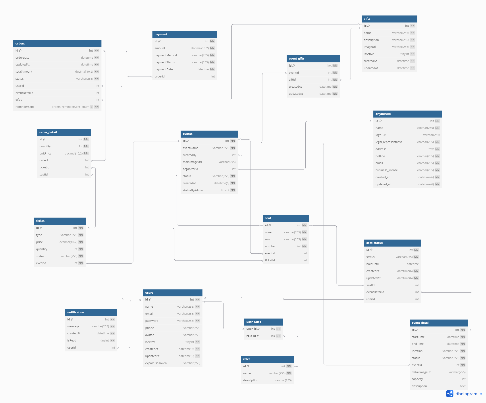

# Hệ Thống Đặt Vé Sự Kiện (Event Ticket System)


## Tổng Quan
Hệ thống Đặt Vé là một ứng dụng web được thiết kế để quản lý và đặt vé cho các sự kiện ca nhạc, giải trí. Hệ thống bao gồm 3 phần chính:
- **Backend (ticket-backend)**: API server xử lý logic nghiệp vụ
- **Frontend (ticket-frontend)**: Giao diện người dùng cho khách hàng đặt vé
- **Admin Web (ticket-admin-web)**: Giao diện quản trị cho nhân viên


## Yêu Cầu Hệ Thống
Chúng ta sẽ tập trung vào các yêu cầu sau đây khi thiết kế Hệ thống Đặt Vé Sự Kiện:

1. Khách hàng có thể tìm kiếm sự kiện theo tên, địa điểm, ngày tổ chức, và thể loại sự kiện.

2. Mỗi sự kiện sẽ có một mã định danh duy nhất và các thông tin chi tiết bao gồm:
   - Tên sự kiện
   - Thời gian tổ chức
   - Địa điểm
   - Mô tả chi tiết
   - Hình ảnh/poster
   - Sơ đồ chỗ ngồi

3. Mỗi sự kiện có thể có nhiều hạng vé khác nhau (VIP,...) với số lượng và giá vé riêng.

4. Hệ thống phải có khả năng theo dõi:
   - Số lượng vé đã bán cho mỗi hạng vé
   - Danh sách người mua vé
   - Trạng thái thanh toán của mỗi đơn hàng

5. Mỗi người dùng chỉ được phép đặt vé cho mỗi sự kiện.

6. Thời gian giữ chỗ tạm thời khi đặt vé là 15 phút, sau thời gian này nếu không thanh toán, hệ thống sẽ tự động hủy đơn.

7. Hệ thống hỗ trợ phương thức thanh toán:
   - Thanh toán qua VNPay

8. Khách hàng có thể xem các trạng thái của sự kiện.

9. Hệ thống sẽ gửi thông báo trong các trường hợp:
   - Khi thanh toán thành công (sẽ gửi về gmail và trên app)
   - Khi thanh toán thất bại (sẽ gửi về gmail và trên app)
   - Khi còn 5 phút để thực hiện thanh toán thanh toán (sẽ gửi về trên app)
   - Khi có thay đổi về sự kiện (thời gian, địa điểm) (sẽ gửi về trên app)

10. Mỗi đơn hàng thanh toán thành công sẽ có 1 mã đơn hàng duy nhất, và trong đơn hàng đó sẽ có số ghế và mã ghế đã thanh toán.

11. Hệ thống phải đảm bảo:
    - Không bán quá số lượng vé có sẵn
    - Không trùng lặp chỗ ngồi
    - Xác thực thanh toán realtime


## Kiến Trúc Hệ Thống


## Chức Năng Chính

### 1. Phân hệ Khách hàng (Frontend)
- Đăng ký/Đăng nhập tài khoản
- Xem danh sách sự kiện
- Tìm kiếm và lọc sự kiện
- Đặt vé và thanh toán
- Xem lịch sử đặt vé
- Quản lý thông tin cá nhân

### 2. Phân hệ Quản trị (Admin)
- Quản lý sự kiện
- Quản lý vé
- Quản lý người dùng
- Quản lý đơn đặt vé
- Thống kê và báo cáo


## Sơ Đồ ERD


## Use Case Diagram


## Mô Hình Chức Năng


## Hướng Dẫn Cài Đặt

### Yêu Cầu Hệ Thống
- Node.js >= 14.x
- MySQL >= 8.0
- Redis (cho session management)

### Backend
```bash
cd ticket-backend
npm install
npm run dev
```

### Frontend
```bash
cd ticket-frontend
npm install
npm run dev
```

### Admin Web
```bash
cd ticket-admin-web
npm install
npm run dev
```

## Cấu Trúc Thư Mục
```
ticket-app/
├── ticket-backend/     # Backend API server
├── ticket-frontend/    # Customer-facing frontend
└── ticket-admin-web/   # Admin dashboard
```

## Lưu Ý
- Các hình ảnh (ERD, Use Case, System Architecture) cần được thêm vào thư mục `docs/images/`
- Cập nhật các biến môi trường trong file `.env` của mỗi service
- Đảm bảo các port không bị conflict khi chạy đồng thời các service

## Liên Hệ
Nếu có bất kỳ câu hỏi hoặc góp ý nào, vui lòng liên hệ với team phát triển. 